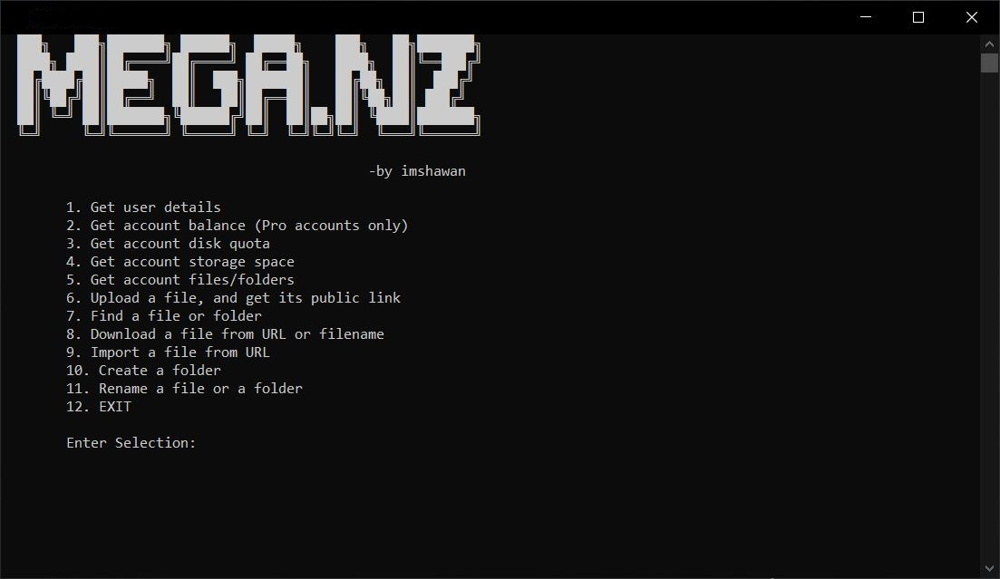
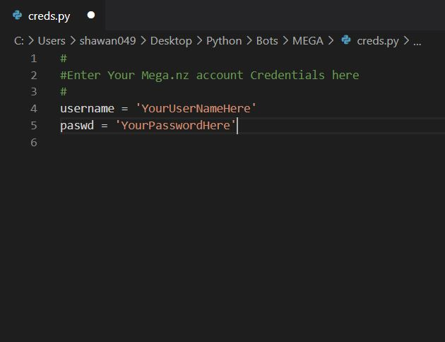

 <br>
# Mega.nz APP Using Python

**Mega.nz APP** is a Python Program that can access your Mega Cloud Drive using your credentials from a file named "creds.py" and then can perform functions like login, uploading, downloading, deleting, searching, sharing, renaming, moving files.

## Required Packages
The program requires the mega.py module in order to perform certain tasks. The module can be installed easily by:

```bash
pip install mega.py
```

## Edit the creds.py file and enter your Mega.nz account username and password
The "creds.py" file <br>


## Usage
Now you can run the program i.e. "megaSM.py" file and perform your stuffs...

## Contributing
Pull requests are welcome. For major changes, please open an issue first to discuss what you would like to change.

Please make sure to update tests as appropriate.

## License
**N/A**\
The code is free to copy and you can use it as the way you like. Thanks for viewing my work.
